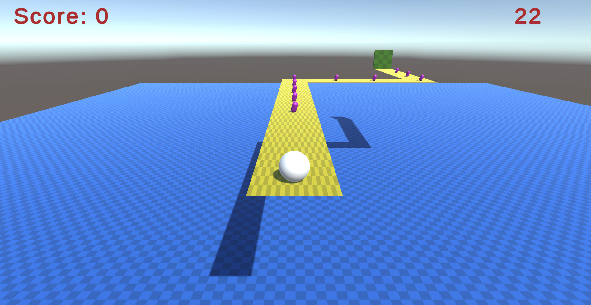

# Balance Ball 3D #

## About the Game ##
If you've ever played a game called Monkey Ball, this game is directly inspired by it.
Your overarching goal is to reach the green door at the end of the pathway without falling
off the platform, collecting capsules for points along the way, within the time limit.

This game was made with Unity version 2020.3.18f1.

## Controls ##
An executable BalanceBall3D.exe can be found in the most recent Build folder. The entire Build folder will be necessary to run the game, though you can also re-build the game from Unity itself.

This game has been modified to be played with keyboard arrow keys. This game was originally developed using a controller as it leveraged the joystick axis.

* Vertical Axis: Rotate the board up or down
* Horizontal Axis: Rotate the board left or right
* Return key: Restart the level
* Escape key: Quit application

If playing from Unity player: Start the game by playing the LevelOne scene. Remember to set to Full HD. Note that if the project settings were appropriately exported, the dead zone in 
the joystick was increased to avoid random stuttering.

## Rules ##
* Your controls allow you to rotate the entire board which should naturally cause
	the white ball to roll on the platform. The maximum rotation for the board 
	is about 10 degrees in all directions.
* You will see purple capsules along the way. If the white ball collides with the 
	capsule, you will receive a point.
* You will see a green rectangular prism/plane near the end of the pathway. If the
	white ball collides with the door, you will be loaded into the next level.
* In the top right, you will see a timer counting down. If you fail to reach
	the door within that time limit, you lose and restart the current level.
* If you fall off the platform, you lose and restart the current level.
* Whenever you lose, you lose any points acquired during the level. Otherwise, points
	are carried forward to the next level.
* There are 5 total levels.
* There are a total of 60 points that can be acquired over 5 levels.
* If you complete the 5th level, you've completed the game. The game will let you
	continue by automatically reloading the 1st level with the points you've
	acquired. Let's call any additional time you spend after the 5th level
	bonus rounds.
* Miscellaneous: When a new scene is loaded, the original light is not re-rendered in
	the editor, so it will be darker. Let's call this a spooky feature.

## Author(s) ##
Contributor(s) names:
* Eric Li